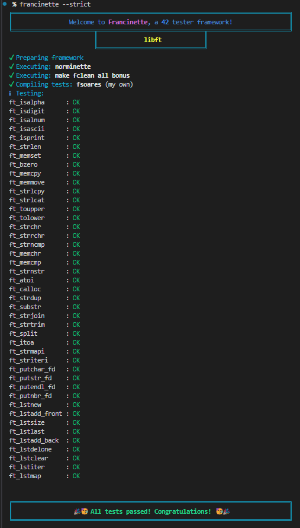

# Libft: C From Scratch 🛠️

Libft is a foundational project where I recreated from scratch a series of essential functions in C. This exercise not only helped me understand how the tools I use daily work but also master key concepts like memory management, string manipulation, and data structure creation.

## 📜 What Is Libft?

Libft is a C library that implements basic functions from the standard library, along with additional utilities and a bonus section for working with linked lists. All functions are built from scratch.

## 🛠️ Implemented Functions

### 1. Libc Functions

| Function | Description |
|----------|-------------|
| ft_isalpha | Checks if a character is alphabetic |
| ft_isdigit | Checks if a character is a digit |
| ft_isalnum | Checks if a character is alphanumeric |
| ft_isascii | Checks if a character is ASCII |
| ft_isprint | Checks if a character is printable |
| ft_strlen | Calculates the length of a string |
| ft_memset | Fills a block of memory with a value |
| ft_bzero | Fills a block of memory with zeros |
| ft_memcpy | Copies a block of memory to another |
| ft_memmove | Copies a block of memory, even if they overlap |
| ft_strlcpy | Safely copies a string |
| ft_strlcat | Safely concatenates two strings |
| ft_toupper | Converts a character to uppercase |
| ft_tolower | Converts a character to lowercase |
| ft_strchr | Finds the first occurrence of a character in a string |
| ft_strrchr | Finds the last occurrence of a character in a string |
| ft_strncmp | Compares two strings up to a limit |
| ft_memchr | Finds a character in a block of memory |
| ft_memcmp | Compares two blocks of memory |
| ft_strnstr | Finds a substring in a string |
| ft_atoi | Converts a string to an integer |

### 2. Additional Functions

| Function | Description |
|----------|-------------|
| ft_calloc | Allocates memory and initializes it to zero |
| ft_strdup | Duplicates a string |
| ft_substr | Extracts a substring from a string |
| ft_strjoin | Concatenates two strings |
| ft_strtrim | Trims specific characters from the start and end of a string |
| ft_split | Splits a string into an array of substrings |
| ft_itoa | Converts an integer to a string |
| ft_strmapi | Applies a function to each character of a string |
| ft_striteri | Applies a function to each character of a string (with index) |
| ft_putchar_fd | Writes a character to a file descriptor |
| ft_putstr_fd | Writes a string to a file descriptor |
| ft_putendl_fd | Writes a string followed by a newline to a file descriptor |
| ft_putnbr_fd | Writes a number to a file descriptor |

### 3. Bonus: Linked Lists

| Function | Description |
|----------|-------------|
| ft_lstnew | Creates a new node |
| ft_lstadd_front | Adds a node to the beginning of the list |
| ft_lstsize | Counts the number of nodes in the list |
| ft_lstlast | Returns the last node of the list |
| ft_lstadd_back | Adds a node to the end of the list |
| ft_lstdelone | Deletes a node and frees its memory |
| ft_lstclear | Deletes all nodes in the list and frees their memory |
| ft_lstiter | Applies a function to each node in the list |
| ft_lstmap | Creates a new list by applying a function to each node |

## 🧠 Defensive Code

- **Memory Management**: I learned to use malloc and free correctly, avoiding memory leaks
- **String Manipulation**: I mastered operations like copying, concatenating, splitting, and trimming strings
- **Data Structures**: I implemented linked lists, a dynamic and powerful structure
- **Defensive Coding**: I learned to write robust code with NULL checks and error handling

## 🔧 Why Is It Important?

Libft is the foundation for more advanced projects in C. It forces you to understand how the tools you use daily work and prepares you for challenges like printf or get_next_line. It also reinforces key concepts like memory management and algorithmic efficiency.

## 📂 Project Structure

```
.
├── libft/               # Main functions
│   ├── bonus/           # Linked list functions
│   └── principal/       # Basic functions
├── includes/            # Header files
└── Makefile             # Automatic compilation
```

## 🚀 Getting Started

1. Clone the repository:
```bash
git clone https://github.com/your-username/libft.git
cd libft
```

2. Build the library:
```bash
make        # Builds core and additional functions
make bonus  # Includes linked list functions
```

3. Use in your projects:
```c
#include "libft.h"

int main(void)
{
    char *str = ft_strdup("Hello, Libft!");
    // Your code here
    return (0);
}
```

## 💡 Best Practices

- Always check return values of memory allocation functions
- Use const qualifiers when appropriate
- Follow the project's coding style guide
- Write clear and concise function documentation
- Test thoroughly, including edge cases

## 🧪 Testing

I used francinette-image to test this project in all possible modes. It runs four tests, and if you pass all of them, you can try the --strict mode, which I found the most useful for improving memory leaks and handling edge cases.




## Conclusion 🎯

Libft is an essential project for any C programmer. It not only teaches you to recreate basic functions but also forces you to understand how they work internally. If you want to master C, this is your starting point.

> "The only way to learn a new programming language is by writing programs in it." - Dennis Ritchie 💭
